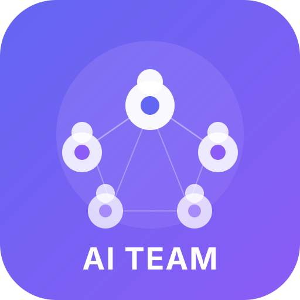

<p align="center">
  
</p>

<h1 align="center">AI Team</h1>

<p align="center">
  <strong>Initialize and run AI agent teams for collaborative vibe coding</strong>
</p>

<p align="center">
  <a href="README_zh.md">中文文档</a>
</p>

---

AI Team provides a unified skill for [Claude Code](https://docs.anthropic.com/en/docs/claude-code) and OpenAI Codex CLI that helps you initialize, run, and update multi-agent teams via `/ai-team init|run|update`. Each agent gets its own role, system prompt, and capability profile, then collaborates through shared project docs and issue directories like a real development group.

The generated prompts and docs are shared assets used by the supported Claude Code and OpenAI Codex CLI workflows. Both platforms support the interactive `/ai-team run` flow for dispatching the current stage directly.

## Mandatory Superpowers Usage

Every team member MUST invoke their designated Superpowers skill before producing work output. This is enforced in the role execution flow.

| Role | Required Skill | When |
|------|---------------|------|
| PM | `/brainstorming` | Before producing requirements |
| Architect | `/plan` | Before producing design or task breakdown |
| Developers (`rd`, `fe`, `be`) | `/tdd` | Before writing implementation |
| Developers (bug/regression) | `/systematic-debugging` then `/tdd` | Debug first, then TDD for the fix |
| QA | `/verify` | Before finalizing test report |
| Designer | `/brainstorming` | Before producing design specs |
| Data Engineer | `/tdd` | Before writing pipeline code |

## Features

- **Guided lifecycle commands** — interactive-only `/ai-team init`, `/ai-team run`, and `/ai-team update` that advance one stage at a time
- **Reusable prompts and docs** — generated markdown assets are shared across the supported Claude Code and OpenAI Codex CLI workflows
- **Mandatory Superpowers integration** — every role must invoke its designated skill (brainstorming, planning, TDD, debugging, verification) before producing output
- **Role-specific system prompts** — each agent knows its identity, responsibilities, and how to collaborate
- **Self-learning agents** — each agent updates its capability profile after every work stage, tracking new skills and growth
- **Structured collaboration** — file-based communication, issue tracking, decision records
- **Approval-gated task workflow** — plan, implement, review, and accept one stage at a time
- **Safe team maintenance** — archive removed roles, refresh active prompts and profiles, and preserve issue history
- **Multi-session support** — run agents in one session or across multiple terminals

## Installation

### Claude Code

**Option A: Project-level skill (recommended for team sharing)**

Copy the skill into your project's `.claude/skills/` directory:

```bash
# In your project root
git clone https://github.com/ruanwenjun/ai-team.git /tmp/ai-team
mkdir -p .claude/skills
cp -r /tmp/ai-team/skills/claude-code/ai-team .claude/skills/ai-team
```

Claude Code auto-discovers skills in `.claude/skills/` — no configuration needed.
Project-level skills only apply when Claude Code is started in this project directory (or one of its subdirectories).

**Option B: Personal skill (available across all projects)**

```bash
# Copy to your personal skills directory
git clone https://github.com/ruanwenjun/ai-team.git /tmp/ai-team
mkdir -p ~/.claude/skills
cp -r /tmp/ai-team/skills/claude-code/ai-team ~/.claude/skills/ai-team
```

**Option C: Symlink (easy updates via git pull)**

```bash
# Clone once
git clone https://github.com/ruanwenjun/ai-team.git ~/ai-team

# Symlink to personal skills
mkdir -p ~/.claude/skills
ln -s ~/ai-team/skills/claude-code/ai-team ~/.claude/skills/ai-team
```

After installation, verify the skill is available:
1. If you installed the skill while Claude Code was already running, exit and start a new Claude Code session
2. Make sure you are in the project root that contains `.claude/skills/`
3. Then run:

```bash
/ai-team init
```

If you still see `Unrecognized command '/ai-team'`, it usually means:
- Claude Code was not started from this project root
- The skill was copied in after the current session started and has not been reloaded yet

### OpenAI Codex CLI

Install the skill into Codex's personal skills directory at `~/.codex/skills/`:

```bash
# Clone the repository
git clone https://github.com/ruanwenjun/ai-team.git /tmp/ai-team

# Create the Codex skills directory
mkdir -p ~/.codex/skills

# Install the skill
cp -r /tmp/ai-team/skills/codex/ai-team ~/.codex/skills/ai-team
```

**Optional: use symlinks for easier updates via `git pull`**

```bash
# Clone once
git clone https://github.com/ruanwenjun/ai-team.git ~/ai-team

# Symlink into Codex skills
mkdir -p ~/.codex/skills
ln -s ~/ai-team/skills/codex/ai-team ~/.codex/skills/ai-team
```

Restart Codex after installation so it can pick up the new skills.

## Quick Start

All subcommands are interactive-only and stage-gated:

```bash
/ai-team init
/ai-team run
/ai-team update
```

- `/ai-team init` asks for language, template or custom composition, project name, and whether to customize role descriptions.
- `/ai-team run` asks whether to start a new task or continue an existing issue, then offers only the next valid stage actions.
- `/ai-team update` asks how to add or remove members, previews the resulting team and archive changes, and applies updates only after confirmation.

Legacy forms (`/init-team`, `/run-team`, `/update-team`) are deprecated. If you used the previous command styles, use the new `/ai-team <subcommand>` form instead.

`/ai-team init` creates a `.ai-team/` directory in your project:

```
.ai-team/
├── team.md                 # Team overview
├── collaboration.md        # How agents work together
├── project/
│   ├── README.md           # Project goals & tech stack
│   ├── issues/             # Task tracking
│   ├── requirements/       # Requirements docs
│   ├── decisions/          # Architecture Decision Records
│   └── changelog.md
├── profiles/               # Each agent's skills & growth
│   ├── pm.md
│   ├── architect.md
│   ├── rd-1.md
│   └── ...
└── prompts/                # System prompts for supported platforms
    ├── pm.md
    ├── architect.md
    ├── rd-1.md
    └── ...
```

`/ai-team update` creates `.ai-team/archive/roles/{id}/` later when roles are removed. It is not part of the initial scaffold.

Each issue is a directory under `project/issues/` containing the issue file and all role worklogs:

```
project/issues/001-user-login/
├── issue.md
├── pm-stage-1-requirement-intake.md
├── architect-stage-2-planning.md
├── rd-1-stage-3-implementation.md
├── qa-stage-4-review.md
└── architect-stage-5-final-review.md
```

## Demo

### Example 1: Standard Web Project

```bash
# Step 1: Initialize a web team
/ai-team init
```

Choose `web-standard`, set the project name to `my-web-app`, pick a language, and confirm the preview. This creates a team with 1 PM, 1 Architect, 2 Developers (rd-1, rd-2), and 1 QA Engineer:

```
Generated .ai-team/ with key files including:
  team.md, collaboration.md
  profiles/pm.md, profiles/architect.md, profiles/rd-1.md, profiles/rd-2.md, profiles/qa.md
  prompts/pm.md, prompts/architect.md, prompts/rd-1.md, prompts/rd-2.md, prompts/qa.md
  project/README.md, project/changelog.md
  project/issues/
```

```bash
# Step 2: Start a new task
/ai-team run
```

Choose a language, select `start a new task`, and enter `implement user login with JWT authentication`.

The skill then runs as a gated sequence:
1. Creates issue directory `001-implement-user-login/` with `issue.md`
2. Launches PM with mandatory `/brainstorming` to capture and clarify the requirement
3. Pauses for your confirmation before architect planning starts
4. Launches architect with mandatory `/plan` to decompose the work and assign rd-1 plus QA
5. Pauses for your confirmation before implementation starts

```
## Stage 1 Summary - Issue #001
- pm: Clarified the login requirement

Awaiting your confirmation to start architect planning.
```

```bash
# Step 3: Approve architect planning
> proceed
```

After you confirm, the workflow continues with architect planning, implementation (with mandatory `/tdd`), QA review (with mandatory `/verify`), final technical review from architect, and PM acceptance. Every role invokes its designated Superpowers skill before producing output.

```bash
# Step 4: Final acceptance
> looks good
```

Issue marked as done.

### Example 2: Updating an Active Team

```bash
/ai-team update
```

Use the action loop to add members, remove members, and finish with a preview before applying:

- removed roles are archived under `.ai-team/archive/roles/{id}/`
- active prompts and profiles are fully regenerated after confirmation
- role IDs are never reused, so a removed `rd-2` becomes `rd-3` if that role type is added again later
- unfinished issues can block removals until work is reassigned or completed

### Example 3: Multi-Session Mode

In Terminal 1:
```bash
/ai-team run
```

Choose `continue an existing issue`, open the same implementation-stage issue, and claim `rd-1` if the stage shows `rd-1: pending` and `rd-2: pending`.

In Terminal 2:
```bash
/ai-team run
```

Select the same issue. The second CLI re-reads the issue, sees the current role-status table, and can claim `rd-2` while `rd-1` is already `in-progress` or `done`. QA is not offered until every role assigned to the implementation stage is `done` and the user approves moving forward.

## Preset Templates

| Template | Composition | Use Case |
|----------|------------|----------|
| `web-standard` | 1 PM + 1 Architect + 2 RD + 1 QA | Standard web project |
| `mobile-app` | 1 PM + 1 Architect + 2 RD + 1 QA + 1 Designer | Mobile application |
| `data-pipeline` | 1 PM + 1 Architect + 2 RD + 1 DE | Data engineering |
| `fullstack` | 1 PM + 1 Architect + 1 FE + 1 BE + 1 QA | Frontend/backend split |
| `minimal` | 1 PM + 1 Architect + 1 RD + 1 QA | Quick validation |

## Built-in Roles

| Abbr | Role | Focus |
|------|------|-------|
| `pm` | Project Manager | Requirement intake, business clarification, final acceptance |
| `architect` | Architect | Requirement decomposition, task assignment, QA routing, README/changelog maintenance, dispute review, final technical review |
| `rd` | Developer | Implementation, code review |
| `qa` | QA Engineer | Testing, defect tracking, quality assurance |
| `fe` | Frontend Engineer | UI, performance, accessibility |
| `be` | Backend Engineer | APIs, databases, server-side logic |
| `de` | Data Engineer | Pipelines, ETL, data quality |
| `designer` | Designer | UI/UX, interaction design, visual specs |

Any abbreviation not listed above is treated as a custom role — AI generates appropriate content automatically.

## Command Model

| Command | Guided flow |
|---------|-------------|
| `/ai-team init` | Choose language, team shape, project name, and role customization settings |
| `/ai-team run` | Choose language, new task vs existing issue, then the next valid stage or role action |
| `/ai-team update` | Choose language, edit the active team through add/remove/review, then confirm changes |

All subcommands are interactive-only. Legacy forms (`/init-team`, `/run-team`, `/update-team`) are deprecated.
The flow is stage-gated, so `/ai-team run` only surfaces the next valid stage or role action for the current issue state.

## How It Works

**`/ai-team init`** generates structured markdown files that define your team. Each agent gets:
- A **system prompt** with its identity, responsibilities, behavioral guidelines, and collaboration instructions
- A **capability profile** tracking skills and growth, with a learning log
- Access to the shared **issue directories** that contain the issue file and all role worklogs

`/ai-team init` always asks for language first, then walks through template or custom composition selection, project naming, optional role customization, and final confirmation.

In Claude Code and OpenAI Codex CLI, **`/ai-team run`** reads these files and runs the current stage either in-session or through the platform's agent/subagent mechanism:
1. Reads the relevant prompts, profiles, and collaboration guidelines
2. Either creates an issue for a new task or resumes an existing issue through the guided flow
3. Tracks each assigned role inside the current stage as `pending`, `in-progress`, or `done`
4. Claims only the selected role or roles for the current run, writes their worklogs to the issue directory, and **updates each active role's capability profile** (new skills, growth areas, learning log)
5. Keeps the workflow in the current stage until every assigned role for that stage is `done`
6. Enters the stage gate only after the whole stage is complete, then waits for your explicit confirmation before moving on
7. Continues through PM requirement intake, architect planning and assignment, implementation, QA review, architect final technical review, and PM final acceptance

`/ai-team run` blocks if the active team does not contain at least one PM, at least one architect, at least one development role, and at least one QA role. In that case, use `/ai-team update` first.

**`/ai-team update`** safely changes an existing team without rewriting issue history:
- archives removed roles under `.ai-team/archive/roles/{id}/`
- regenerates prompts and profiles for every active role after confirmation
- appends a team update entry to `.ai-team/project/changelog.md`
- preserves historical references because role IDs are never reused

Agents communicate through files — issues, worklogs, and `@{role-id}` mentions in documents.

**Self-learning:** After each work stage, every agent reflects on what it learned and updates its `profiles/{id}.md`. Over time, each agent's profile becomes a rich record of accumulated skills and experience — making future task assignments more informed.

## License

Apache License 2.0 — see [LICENSE](LICENSE) for details.
